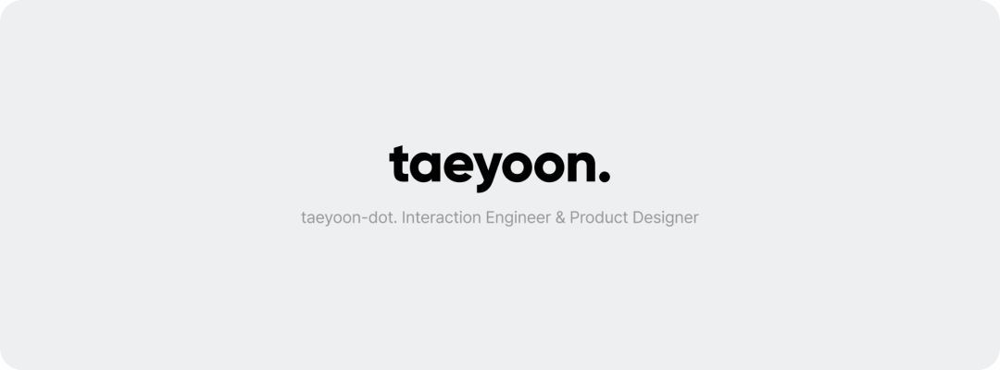

  

<h1 align="center">Taeyoon Lee <a href="https://github.com/taeyoon0137"><code>@taeyoon0137</code></a></h1>

  👋 반가워요. <a href="https://whatssub.co">왓섭</a>에서 인터렉션 엔지니어와 프로덕트 디자이너를 맡고 있는 이태윤입니다.

  

## 👋 About Me

- Interaction Engineer & Product Designer [@Whatssub Co., Ltd.]
- [Resume – Taeyoon Dot.]

## 🔥 Tech Stack

<blockquote>
  <h3>1. Design</h3>

  
  
  
  
  
  
  
  
</blockquote>

<blockquote>
  <h3>2. Engineering</h3>

  
  
  
  
  
</blockquote>

## 📌 Tips

- 이 [README.md] 상단의 배너는 라이트모드와 다크모드에 따라 색상이 변한답니다!

[@Whatssub Co., Ltd.]: https://whatssub.co
[Resume – Taeyoon Dot.]: https://taeyoon0137.github.io/resume
[README.md]: #
